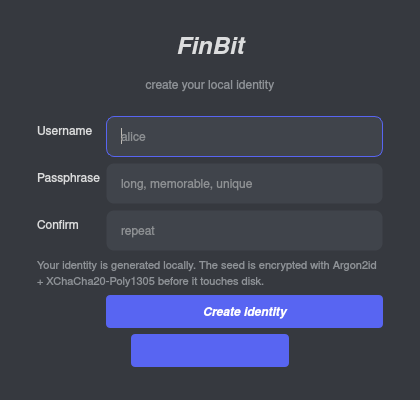
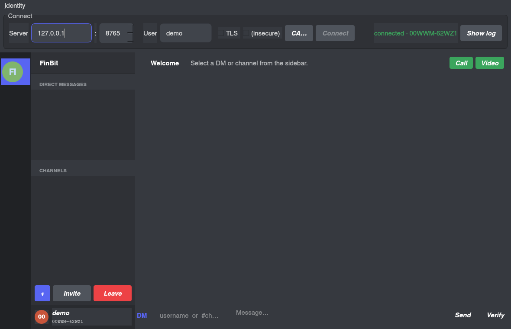

# FinBit

End-to-end encrypted, mesh-bridged, eventually-decentralized chat. Discord-style
UI, Signal-grade crypto, your own relay. **C++20** core compiled native (desktop
+ server) and to WebAssembly (browser). Voice + video over real WebRTC.

> **Status:** prototype. The cryptography uses well-vetted primitives
> (libsodium Ed25519 / X25519 / XChaCha20-Poly1305 / Argon2id, signal Double
> Ratchet, SenderKeys for groups), but the codebase as a whole has not had
> independent crypto review. Run it on a network you control; do not stake
> your physical safety on it yet.

|  | desktop (Qt6) | web (WASM) |
|---|---|---|
| Login dialog |  | (similar — `client-web/ui/login_ui.js`) |
| Main UI |  | Discord-style HTML/CSS/JS in `client-web/ui/` |

> The connect bar's `TLS / (insecure) / CA…` trio drives a direct
> `wss://` to the relay (no reverse proxy needed). The channel-create
> dialog has an "MLS encryption?" checkbox. **Show log** surfaces
> serverless overlay events (`peer-net listening`, `dht published`,
> `gossip joined fb-chan:…`) once the env-driven P2P stack is on.

## What's real today

- **DMs** — Signal Double Ratchet over libsodium, AES-256-GCM (native) /
  XChaCha20-Poly1305 (WASM, no AES-NI). Server only ever sees ciphertext —
  and in serverless mode it sees nothing at all (see "Serverless overlay"
  below). 183 native tests + 9 web smokes + 10 end-to-end shell demos pass.
- **Channels** — Two interoperable group-crypto paths:
  - **SenderKeys** (default) — per-(group, sender) symmetric chains with
    replay rejection, out-of-order delivery, post-eviction key
    invalidation. Invitees join via a `channel_key` DM payload.
  - **MLS / RFC 9420** (opt-in) — vendored
    [cisco/mlspp](https://github.com/cisco/mlspp) via
    `scripts/fetch-mlspp.sh` + `cmake -DFB_FEATURE_MLS=ON`. Full A→G
    pipeline: in-band `MlsInviteRequest → MlsKeyPackage → MlsCommit
    → MlsWelcome` four-step join, multi-member 2-broadcast Add, MLS
    application encrypt/decrypt routed through `mls::State`,
    UI checkbox in the channel-create dialog. Surviving restart via
    an operation-replay persistence layer above `mls::State` (the
    only acknowledged limitation in the v0 MLS path is now closed —
    193 MLS-build tests pass including end-to-end alice/bob
    restoration after process restart). See
    `docs/security-audit.md §10` for the design.
- **Login** — Argon2id-protected identity vault on disk. v2 format binds
  KDF params into AEAD AAD (no downgrade), MODERATE tier (~256 MiB / ~1.5s
  per guess). Vault file is byte-identical between web and desktop.
- **Server-side username binding** — Ed25519 challenge-response on
  ClientHello + HelloAck. `RegisterReq` enforces claim-pubkey == auth-bound
  pubkey (no cross-binding). Second `Hello` on an authed connection is
  rejected. `USERNAME_TAKEN` `ControlMessage` on conflict.
- **1:1 voice + video** — Real WebRTC. Web uses browser-native
  `RTCPeerConnection`. Desktop uses GStreamer `webrtcbin`. Both speak
  Opus + VP8 + standard SDP/trickle ICE — they interop. Signaling tunneled
  through the existing Double Ratchet (SDP / ICE never plaintext to the
  relay or any TURN server). DTLS-SRTP between peers + an SFrame layer on
  encoded frames (per-call key derived from X3DH-shared ‖ HKDF(call_id))
  so a future SFU still couldn't read media.
- **Channel voice (full-mesh)** — Click `Call` while a channel is
  selected: the desktop sends `RoomJoin`, the server fans out a
  `RoomRoster` to every joined participant, and each pair auto-dials a
  1:1 PeerConnection (glare-tiebreak by pubkey). Lazy session bootstrap:
  if you've never DM'd a roster member, the client transparently does
  `username_lookup → key_fetch → init_alice → retry`. Self-mute toggle
  fans out across every leg. Caps around 5–6 participants until the SFU
  upgrade lands.
- **Envelope-level integrity** — `Envelope.aad = envelope_id ‖
  u64_be(timestamp_ms)` is bound by the inner ratchet/SenderKeys AEAD
  tag. A relay rewriting either field invalidates the tag; rewriting all
  three consistently is detected by the receiver's cross-check.
- **Persistence (encrypted at rest)** — SQLite, with every sensitive
  column AEAD-wrapped per-row using XChaCha20-Poly1305 keys derived from
  the vault seed via HKDF (`info = "FinBit-DB-<Table>-v1"`). Inbox,
  outbox, ratchet sessions, channel state + peer distributions, channel
  inbox, and the username cache all opaque on disk. `PRAGMA
  user_version = 3` marks the encrypted schema; opening without a key
  throws. Migrations from legacy plaintext run inside a single
  transaction.
- **WebSocket transport** on the server (`--ws-port`) so browser clients
  connect natively.
- **TLS transport** — three flavours, all using one OpenSSL link on the
  server side:
  - `--tls-port` — TLS-wrapped WebSocket (`wss://`). Browsers from
    `https://` pages connect without a reverse proxy.
  - `--tls-raw-port` — TLS-wrapped raw frames. Same wire format as
    `--port`, just with TLS underneath. Lets fb-cli + the desktop
    client run on a likely-open port like 443 and look like HTTPS to
    a passive observer. Client side: fb-cli `--tls / --tls-ca /
    --tls-insecure-skip-verify / --tls-sni`; the desktop client has
    a "TLS / (insecure) / CA…" trio in the connect bar.
  - `tls_client.{hpp,cpp}` — reusable OpenSSL client wrapper with
    SNI, X509 hostname binding, and a select-driven non-blocking
    handshake that handles WANT_READ / WANT_WRITE in both
    directions.
- **Serverless overlay** — full peer-to-peer username + reachability +
  *delivery* layer that survives the central server going away:
  - **Username log** — append-only signed claim log binding usernames
    to Ed25519 pubkeys. Same shape as Nostr / Sigstore-Rekor: signed
    events, no consensus, deterministic conflict resolution
    (smallest valid timestamp wins). Eventually consistent through
    gossip — late-arriving older claims flip the resolved owner
    without breaking any rule. Used by the desktop send path: when
    you address a peer by username, we resolve it locally first
    before considering server-side `username_lookup`.
  - **DHT provider records + prekey bundles** — signed
    `(pubkey → addresses + ttl)` and `(pubkey → SPK + OPK)` bindings
    keyed by publisher pubkey. `DhtNode::publish()` sends to the K
    closest peers in the routing table; `lookup()` queries them and
    aggregates deduped responses. Wire format keyed by
    `node_id_from_pubkey = SHA-256(pubkey)[0..20]` (Kademlia
    convention). The send path issues an **async DHT prekey lookup**
    in parallel with the legacy `KeyFetchRequest` — whichever
    returns first (with a valid Ed25519 signature) drives
    `init_alice`.
  - **Mutual-TLS peer auth** — `PeerNet` serves an X.509 cert whose
    subject pubkey *is* the node's identity Ed25519 (pure-EdDSA via
    `X509_sign(..., nullptr)`). Both sides extract the peer's
    `sender_pubkey` from the SSL-handshake cert, not from the
    application payload — a peer cannot impersonate another for
    DHT routing-table updates or PeerEnvelope dispatch.
  - **PeerEnvelope transport (3-way fallback)** — overlay traffic
    rides on:
    1. **Direct TLS peer-to-peer** via `PeerNet` (each node
       optionally runs a TLS listener; outbound dials go through
       a connection pool). Preferred when the peer's
       `FB_PEER_PUBLIC_ADDR` is dialable.
    2. **Friend-relay offline store** — a third peer accepts
       `OFFLINE_DEPOSIT(envelope)` for a recipient it knows; the
       recipient `OFFLINE_FETCH`es on next start and the relay
       hands back stored `OFFLINE_DELIVERY` frames. Pure peer
       cooperation, no central server in the loop.
    3. **Central server** as a last-resort opaque relay (`Frame.peer`,
       payload never parsed by the server).
    Wire format is the same on every path; the receiver dispatches
    through one hoisted `dispatch_envelope` lambda regardless of
    which transport delivered the bytes. Kinds covered: `DHT`,
    `GOSSIP`, `DM` (full `DmPayload` coverage including
    `key_fetch_*`), `OFFLINE_DEPOSIT/FETCH/DELIVERY`.
  - **First-contact parking lot** — when you DM a peer for whom we
    just resolved a fresh pubkey from the username log, the send
    is parked (≤2 s) while `DhtNode::lookup` races to fetch the
    SPK. If the prekey arrives in time we run `init_alice`
    locally; on timeout we fall through to the server-side
    `KeyFetchRequest`.
  - **Channel + room gossip topics** — channels publish on
    `fb-chan:<hex32>` and voice rooms publish on `fb-room:<hex32>`
    (separate prefixes prevent crosstalk, see `RoomGossip.TopicNameDeterministicAndDistinctFromChannel`).
    Receivers tag observed payloads with `GOSS` / `ROOM` sentinels
    in an overlay inbox so the worker loop can demultiplex them
    back through `dispatch_envelope`. Voice rooms re-fire a
    presence beacon every 25 s so peers joining mid-call still
    see existing participants; the union of beacons is fed into
    the same `apply_room_roster` mesh-dial path the server's
    `Frame.room_roster` uses, so a two-peer room negotiates over
    gossip end-to-end (`RoomGossip.TwoNodeBeaconUnionMatchesServerRoster`,
    `RoomGossip.LateJoinerSeesPeriodicRepublish`).
  - **Cert-pinned wss:// URLs** — `wss://host:port#hexfingerprint`
    pins the relay's TLS cert by SHA-256 fingerprint, so even an
    operator-rotated cert can't silently replace itself.
  - **Bootstrap loader** — `~/.finbit/bootstrap.txt` (or
    `$FB_BOOTSTRAP_FILE` / XDG / `/etc/finbit/`) seeds the routing
    table on startup. One peer per line: `<hex-pubkey-32>  <addr>`
    with `#` comments allowed.
  - **Periodic cadence** — `republish_self` rotates our own
    provider record before its TTL expires (default every 30
    minutes; TTL is 1 hour). `gossip_pull_round` walks every
    routing-table peer and `sync_with`s from a per-peer
    high-watermark every 5 minutes.
- **P2P (legacy)** — Kademlia DHT + gossipsub primitives in `core/`.
  fb-cli has `--p2p-create` / `--p2p-listen` modes; 4-peer no-server
  demo passes (`tools/e2e/p2p_roundtrip.sh`).
- **Mesh bridge (serial)** — POSIX `termios` + brotli, fits a typical
  chat line in one ~200-byte LoRa frame.
- **MQTT bridge** — Eclipse Paho C++ vendored under `third_party/`,
  round-trip tested with an embedded amqtt broker.

## What's still gated

| Subsystem | Blocker |
|---|---|
| SFU mode for >6-participant calls | mediasoup or Janus integration; full-mesh works for small rooms today |
| Android client | NDK not installed in this dev env (Kotlin/Compose scaffold ready) |
| iOS client | not started |
| Desktop UI for `PeerNet` config | currently env-var driven (`FB_PEER_LISTEN_PORT/CERT/KEY`, `FB_PEER_DIALER_*`, `FB_PEER_PUBLIC_ADDR`, `FB_GOSSIP_PORT`, `FB_OFFLINE_RELAYS`). A "Network…" preferences panel is a small follow-up — the underlying P2P + DHT + offline-relay stack is fully wired and tested. |
| WebRTC SDP/ICE over gossip | done — `fb-room:<hex>` gossip carries periodic presence beacons (every 25 s) that feed the same `apply_room_roster` mesh-dial path the central server's `RoomRoster` Frame uses; SDP/ICE itself rides on `DmPayload.media_signal` which already prefers direct PeerNet. The gate is closed for two-peer rooms with gossip enabled — a full SFU is the remaining capacity story. |

The full architectural plan (Phases 0–5, libwebrtc story, federation) lives
in `docs/architecture.md`. The wire protocol is in `docs/protocol-spec.md`.
The threat model (what FinBit defends against, what it doesn't) is in
`docs/threat-model.md`; a layer-by-layer audit of the current
implementation — primitives, protocols, at-rest, voice/video, plus a
canary-grep verification that the server is empirically blind to message
content — lives in `docs/security-audit.md`. What's intentionally not in
v1.x (SFU, mobile clients, mutual-TLS for peer auth, etc.) is in
`docs/ROADMAP.md` with effort estimates and rationale.

---

## 5-minute quick start (Linux)

### 1. Install build prereqs

```bash
# Arch
sudo pacman -S cmake gcc libsodium sqlite protobuf fmt spdlog gtest \
               qt6-base brotli paho-mqtt-cpp gst-plugins-base gst-plugins-good \
               gst-plugins-bad gst-plugins-ugly

# Ubuntu 24.04
sudo apt install cmake build-essential libsodium-dev libsqlite3-dev \
                 libprotobuf-dev protobuf-compiler libfmt-dev libspdlog-dev \
                 libgtest-dev qt6-base-dev libbrotli-dev libpaho-mqttpp-dev \
                 libgstreamer1.0-dev libgstreamer-plugins-bad1.0-dev \
                 gstreamer1.0-plugins-base gstreamer1.0-plugins-good \
                 gstreamer1.0-plugins-bad gstreamer1.0-plugins-ugly
```

### 2. Build

```bash
cmake -S . -B build
cmake --build build -j
ctest --test-dir build --output-on-failure   # 183 native tests
```

For the MLS opt-in path:

```bash
scripts/fetch-mlspp.sh                       # vendor + apply patches
cmake -S . -B build-mls -DFB_FEATURE_MLS=ON
cmake --build build-mls -j
ctest --test-dir build-mls --output-on-failure   # 193 native tests
```

### 3. Run a local relay

```bash
build/server/fb_server --port 8765 --ws-port 8766 \
                              --offline-db /tmp/fb.db
```

You'll see:

```
[server] WS listening on 127.0.0.1:8766
[server] TCP listening on 127.0.0.1:8765
```

### 4. Open the desktop client

```bash
build/client-desktop/fb_desktop
```

The login dialog asks for a username + passphrase the first time; subsequent
runs sign you back in with the passphrase only. After signing in, leave the
host as `127.0.0.1` and click **Connect**.

### 5. Open the web client (optional)

```bash
# Build the WASM module — needs emsdk activated.
source ~/emsdk/emsdk_env.sh
scripts/build-wasm.sh

# Static dev server (Python 3 stdlib).
scripts/run-web-dev.sh
# → http://127.0.0.1:8080/ui/
```

In the browser, sign in with a passphrase, point the WS URL at
`ws://127.0.0.1:8766`, and click **Connect**.

### 6. Try a DM, a call, and a channel

In two clients (any combination of desktop and web), claim distinct
usernames, click the other peer in the DM list, send a message, and click
**Call** or **Video**. You should hear / see each other.

For a group voice call: one side clicks `+` and creates a channel, then
`Invite` and types the other's username. Both peers click the channel,
both click **Call** — the desktop's full-mesh dialer handshakes a
PeerConnection between every pair (so a 3-person room is 3 paired calls,
4-person is 6, etc., capped around 5–6 before bandwidth hurts). Self-
mute on the call banner is one toggle that fans out across every leg.

---

## Going live (so others can connect)

Bind to all interfaces and let the server print every reachable URL:

```bash
build/server/fb_server --public --port 8765 --ws-port 8766 \
                              --offline-db /var/lib/fb.db
```

Output:

```
[server] WS listening on 0.0.0.0:8766
[server] TCP listening on 0.0.0.0:8765
[server] reachable at:
         tcp:  192.168.1.102:8765
         ws:   ws://192.168.1.102:8766
[server] NOTE: browsers refuse ws:// from https:// pages — for
         a public deployment, terminate TLS in a reverse proxy
         (caddy / nginx) and proxy wss:// to the ws-port above.
```

Open the firewall ports your cloud provider needs. A Caddyfile that
terminates TLS and forwards browser connections looks like:

```caddy
fb.example.com {
  reverse_proxy /ws  127.0.0.1:8766
}
```

`fb_server --help` has the full deployment cheat sheet.

---

## Testing

### Native tests

```bash
ctest --test-dir build --output-on-failure       # 183 tests, default
ctest --test-dir build-mls --output-on-failure   # 193 tests, FB_FEATURE_MLS=ON
```

The default build covers crypto KAT, ratchet behaviour (including
AAD-tamper rejection), SenderKeys forge/replay rejection, SqliteStore
at-rest AEAD round-trip + canary-not-on-disk asserts + unkeyed-reopen
rejection, P2P relay + dedup, server directory, serial mesh
round-trip, **DhtNode publish/lookup over an in-process bridge**,
**UsernameGossip pull/push convergence**, **PeerNet TLS round-trip
across two loopback instances** (skipped when `openssl(1)` isn't on
PATH), bootstrap-file parser, plus the rest.

The MLS build adds 10 more tests on top of that — `MlsFacade` for the
wrapper layer (create / two-member add / three-member multi-broadcast /
persistence seed + log replay), the matching `TmpDb.MlsGroup*`
SQLite-table round-trips, and `MlsPersistTmpDb` integration tests that
simulate a process restart and assert byte-equivalent post-restore
behaviour.

ASan + UBSan are clean against the same suite (one pre-existing
timing-sensitive `TokenBucket.NeverExceedsBurst` excluded — not a
regression):

```bash
cmake -S . -B build-asan -DCMAKE_BUILD_TYPE=Debug \
    -DCMAKE_CXX_FLAGS='-fsanitize=address,undefined -fno-omit-frame-pointer -g'
cmake --build build-asan --target fb_core_tests -j
ASAN_OPTIONS=detect_leaks=0 ctest --test-dir build-asan \
    -E TokenBucket.NeverExceedsBurst --output-on-failure
```

### Web smokes

Web smokes are Node.js scripts that drive the WASM module + a real
`fb_server` over WebSockets:

```bash
# Start the server in another terminal:
build/server/fb_server --port 8765 --ws-port 8766

cd client-web
NODE=~/emsdk/node/22.16.0_64bit/bin/node    # or your system node

$NODE test/wasm_roundtrip.js                # crypto self-test
$NODE test/wasm_channel_node.mjs            # SenderKeys (no server)
$NODE test/seal_seed_node.mjs               # vault round-trip
$NODE test/media_signal_node.mjs            # call signaling + SFrame
$NODE test/key_fetch_correlation_node.mjs   # request_id correlation
$NODE test/web_channel_node.mjs             # 2-client channel via server
$NODE test/username_takeover_node.mjs       # impostor rejection
$NODE test/auth_security_node.mjs           # 5 server-auth attacks
$NODE test/vault_security_node.mjs          # 9-offset tamper attack on vault
```

The two `*_security_node.mjs` smokes are the adversarial battery — they
mount tamper / replay / cross-bind / downgrade attacks and assert the
server / vault rejects them.

### End-to-end shell demos

Each spins up the necessary processes, runs a scripted exchange, and asserts
a randomized plaintext marker never appears in any relay's logs:

```bash
tools/e2e/dm_roundtrip.sh                       # 1:1 DM via Double Ratchet
tools/e2e/channel_inband_roundtrip.sh           # channel via DM-delivered SenderKeys
tools/e2e/legacy_channel_file_mode_roundtrip.sh # channel join via shared dist file
tools/e2e/p2p_roundtrip.sh                      # 4-peer P2P, no central server
tools/e2e/offline_persist.sh                    # queued DM survives restart
tools/e2e/server_persist_full.sh                # directory + prekeys + queue persist
tools/e2e/username_resolve.sh                   # pubkey → username resolution
tools/e2e/web_dm_roundtrip.sh                   # browser-style WebSocket DM
tools/e2e/wss_dm_roundtrip.sh                   # full TLS round-trip via --tls-raw-port
tools/e2e/peer_envelope_relay.sh                # PeerEnvelope (DHT/gossip) via central
                                                # server's Frame.peer relay
```

Each spins up its own `fb_server`, generates ephemeral certs where
needed, and asserts a randomized plaintext marker never appears in
the relay's logs.

---

## Repo layout

```
core/                         shared C++20 library (crypto, proto, net,
                              p2p, media SFrame, mesh, store, ratelimit)
server/                       fb_server — single-process epoll relay
client-desktop/               fb_desktop — Qt6 client with login + calls
client-web/                   WASM module + Discord-style HTML/CSS/JS UI
client-mobile-android/        Kotlin/Compose scaffold (NDK pending)
tools/                        fb-cli, mesh-loopback, e2e shell demos
docs/                         architecture, protocol-spec, threat-model,
                              security-audit (per-layer crypto walkthrough)
scripts/                      build-wasm, build-libsodium-wasm,
                              build-paho, run-web-dev, etc.
```

Each `client-*/README.md` and `tools/*/README.md` has more detail on the
subsystem.

---

## Security model — brief

- **The server is a blind relay.** Every DM and channel message is opaque to
  it: the AEAD ciphertext, plus a recipient pubkey for routing, plus a
  sender pubkey for rate limiting. Verified empirically — every
  `tools/e2e/*.sh` round-trip greps the server log for a randomized
  plaintext canary and fails the build if it appears.
- **Envelope-level metadata is bound by the inner AEAD tag.**
  `Envelope.aad = envelope_id ‖ u64_be(timestamp_ms)` is fed as
  `outer_aad` to the inner ratchet/SenderKeys encrypt; receivers
  cross-check `aad` against the reconstruction. A relay rewriting either
  field (or substituting all three consistently) is detected.
- **Identity = Ed25519 keypair.** No usernames, no email — your fingerprint
  (a 10-char Crockford base32) is the durable identifier. Usernames are a
  display affordance the server enforces uniqueness on.
- **Login = unlock the at-rest vault.** Argon2id MODERATE tier (~256 MiB /
  ~1.5s) over XChaCha20-Poly1305. KDF params bound into AEAD AAD so the
  vault format itself can't be downgraded by a write-capable attacker. v1
  vaults (104 bytes, no AAD) still readable for migration.
- **Local SQLite store is encrypted at rest.** Inbox, outbox, ratchet
  sessions, channel state + peer distributions, channel inbox, and the
  username cache are AEAD-wrapped per row using XChaCha20-Poly1305 keys
  derived from the vault seed via HKDF. A stolen data dir without the
  passphrase yields no message content. `PRAGMA user_version = 3` marks
  the encrypted schema; opening without a key throws.
- **Voice + video has two layers.** DTLS-SRTP between peers (mandatory in
  WebRTC) plus SFrame on encoded audio/video frames, keyed per call from
  HKDF(X3DH-shared, info="FinBit-SFrame-call-v1-" ‖ hex(call_id)). For
  v0's full-mesh topology each pair has its own DTLS-SRTP, server sees
  no media; SFrame matters when an SFU eventually lands.
- **Username binding is server-enforced.** Anyone with the public key can
  send messages claiming any username they like, but the server will only
  bind a username to one pubkey at a time — second client with a different
  pubkey gets a `USERNAME_TAKEN` `ControlMessage` and gets disconnected.
- **Transport-layer confidentiality is now built in.** Server has
  `--tls-port` (browser WSS) and `--tls-raw-port` (native clients
  including fb-cli + the desktop app). Both validate certs against
  the system trust store by default; the desktop UI has a CA
  picker for custom-CA pinning, plus an "(insecure)" escape hatch
  for self-signed dev servers. Reverse proxy is no longer required
  for end-to-end encryption to work over a hostile network.
- **Group forward secrecy** has the long-term answer: MLS (RFC 9420)
  ships behind `cmake -DFB_FEATURE_MLS=ON` with a UI checkbox
  ("Create with MLS encryption?"). Operation-replay persistence
  layer keeps MLS channels usable across restarts (closed §10
  gap; see `docs/security-audit.md`).
- **Mutual-TLS for peer auth.** `PeerNet` serves an X.509 cert whose
  subject pubkey *is* the node's identity Ed25519 (pure-EdDSA via
  `X509_sign(..., nullptr)`). Each side extracts the peer's
  `sender_pubkey` from the SSL handshake — application-payload
  `sender_pubkey` fields are cross-checked, never trusted on their
  own. A peer cannot impersonate another for DHT routing-table
  updates or PeerEnvelope dispatch.
- **What's still NOT protected:** metadata against the central
  server *when it's used*. The serverless overlay (`PeerNet` direct
  P2P + DHT + username log gossip + friend-relay offline store) is
  the way out: when both peers have dialable addresses
  (`FB_PEER_PUBLIC_ADDR`), or when a mutual friend is reachable for
  offline deposit, traffic skips the central server entirely —
  including DM `Frame.envelope` payloads, channel envelopes (via
  `fb-chan:` gossip), and voice-room presence (via `fb-room:`
  gossip). The central server remains an optional fallback for
  unreachable peers and never sees envelope contents.

Full threat model: `docs/threat-model.md`. Layer-by-layer audit of the
implementation: `docs/security-audit.md`.

---

## Releases

Pre-built binaries for Linux x86_64 and Windows x64 are published
on the [Releases page](../../releases) in two flavours:

| Release | Updated | Stability |
|---|---|---|
| **`v1.x.x`** (tagged) | When a maintainer cuts a release | Stable — runs `ctest`, refuses to publish on failure |
| **`nightly`** | Every push to `main` | Bleeding-edge — same `ctest` gate, but no manual review |

### Linux x86_64

`finbit-linux-x86_64*.tar.gz` contains `bin/fb_server`,
`bin/fb_desktop`, `bin/fb-cli`, the LICENSE, README, CHANGELOG,
ROADMAP and a `RUNTIME_DEPS.md` apt/pacman cheat-sheet. A `.sha256`
sidecar lets you verify the download.

```bash
wget https://github.com/Finmacjones/finbit/releases/download/v1.0.1/finbit-linux-x86_64-v1.0.1.tar.gz
tar xzf finbit-linux-x86_64-v1.0.1.tar.gz
finbit-linux-x86_64-v1.0.1/bin/fb_server --help
```

### Windows x64

Two Windows artifacts ship per release:

- **`finbit-windows-x64.zip`** — server + CLI bundle: `fb_server.exe`,
  `fb-cli.exe`, the vcpkg DLLs they link against (libsodium,
  protobuf, sqlite3, brotli, openssl, zlib, paho-mqtt for the mesh
  feature), and the LICENSE / README / CHANGELOG / ROADMAP docs.
- **`finbit-windows-x64-desktop.zip`** — Qt6 chat GUI + GStreamer
  voice/video stack: `fb_desktop.exe` plus the Qt platform plugins
  (via `windeployqt`) and the GStreamer runtime DLLs. The desktop
  build is newer and currently `continue-on-error` while it
  stabilises — see `docs/windows-port-status.md` for the per-feature
  status table.

Both have `.sha256` sidecars to verify the download. The build is
MSVC (Visual Studio 17 2022) on the `windows-latest` GitHub runner.

Tagged release:

```powershell
# PowerShell (or any browser — direct download from the Releases page)
Invoke-WebRequest -Uri https://github.com/Finmacjones/finbit/releases/download/v1.0.1/finbit-windows-x64.zip -OutFile finbit-windows-x64.zip
Expand-Archive finbit-windows-x64.zip -DestinationPath finbit-win
.\finbit-win\fb_server.exe --help
```

Nightly:

```powershell
Invoke-WebRequest -Uri https://github.com/Finmacjones/finbit/releases/download/nightly/finbit-windows-x64.zip -OutFile finbit-windows-x64.zip
```

### Cutting a new tagged release (maintainers)

```bash
# Bump the version in CHANGELOG.md, commit, then:
git tag v1.0.2
git push origin v1.0.2
```

The tag push triggers `.github/workflows/release.yml`, which builds the
full Linux release on a fresh Ubuntu 24.04 runner, runs `ctest`
(refuses to publish if anything fails), packages the three binaries +
docs into a tarball, and creates a GitHub Release with auto-generated
notes from the commit history since the previous tag. From v1.x
onward releases are marked as full releases (not pre-release); v0.x is
reserved for any pre-1.0 fixup tags should you ever need them.

### How the nightly works

Every push to `main` runs `.github/workflows/ci.yml` which builds, tests,
AND updates a single rolling release tagged `nightly`. Marked as
prerelease so it doesn't replace the most recent tagged `v*` release as
the "Latest" badge on the repo home page. The `nightly` tag always
points at the head of `main`; assets are replaced in place (no spam).

---

## Contributing

The cryptographic primitives in `core/crypto/` are the most sensitive part
of the codebase. Pull requests touching them should:

1. Add or extend a unit test in `core/tests/crypto/`
2. Run the full smoke battery (`ctest` + the `*_security_node.mjs` web
   smokes) and paste the output in the PR
3. Document any wire-format change in `docs/protocol-spec.md`

For everything else: a focused PR with a passing `ctest` is fine.

`docs/architecture.md` has the high-level design; `docs/protocol-spec.md`
has the wire format; `docs/threat-model.md` has the security boundaries
and known limitations.

---

## License

[**GNU Affero General Public License v3.0**](LICENSE) — same license Signal,
Element, and Matrix Synapse use.

The AGPL is "viral" in a way that matters here: anyone who runs a modified
FinBit server, even as a hosted SaaS where the modified binary is never
distributed, must publish their source. For an end-to-end-encrypted
messaging app whose security guarantee depends on what code is actually
running on the relay, that's the right default — users of a hosted FinBit
deployment can audit the server they're actually talking to, not just the
code in this repository.

If you want to use FinBit's crypto primitives (`core/crypto/`) under a
different license, open an issue — dual-licensing is on the table for
narrow, sensible cases.

---

## Acknowledgements

- libsodium for the cryptographic primitives
- Signal for the Double Ratchet + SenderKeys designs
- IETF MLS WG for the eventual group-crypto path (RFC 9420)
- Eclipse Paho for the MQTT bridge
- GStreamer for the desktop voice/video stack
- Discord for the UI conventions everyone now expects from a chat app
